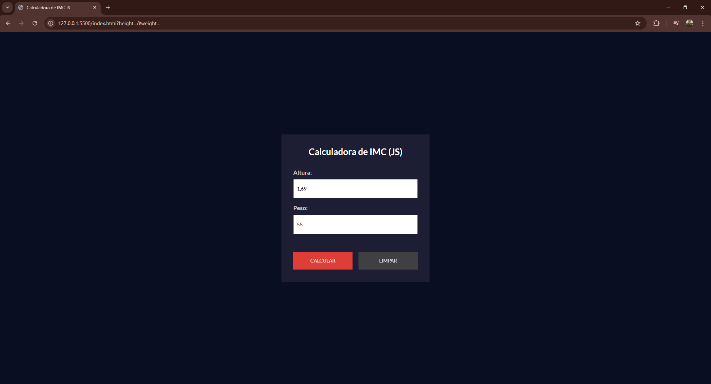
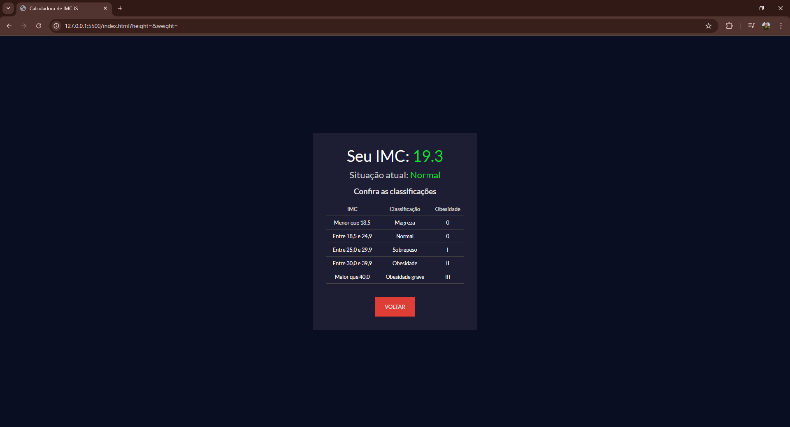

# 📈 Calculadora de IMC (JavaScript)

Projeto de uma **Calculadora de IMC (Índice de Massa Corporal)** desenvolvida com **HTML5**, **CSS3** e **JavaScript** puro.  
A aplicação permite ao usuário inserir altura e peso, calcular o IMC automaticamente e exibir a classificação de forma interativa e responsiva.

## ✨ Funcionalidades

- Validação de entrada de dados (permite apenas números e vírgulas)
- Cálculo do IMC com precisão
- Exibição de classificação de saúde baseada no valor do IMC
- Tabela dinâmica com todas as categorias de classificação
- Botões para **Calcular**, **Limpar** e **Voltar**
- Interface moderna e responsiva

## 🛠️ Tecnologias Utilizadas

- HTML5
- CSS3 (Flexbox)
- JavaScript (ES6+)
- Google Fonts (Lato)

## 🎯 Como Usar

1. Clone este repositório:
   ```bash
   git clone https://github.com/LuanJsv/Calculadora_IMC.git


2. Acesse a pasta do projeto:

cd Projeto_Calculadora_IMC

3.Abra o arquivo index.html em seu navegador.

## 📸 Demonstração
A calculadora de IMC possui um layout moderno e intuitivo.
Ao abrir o projeto, o usuário encontrará dois campos para inserir sua altura (em metros) e peso (em quilos).
Após clicar em Calcular, o IMC é apresentado junto da classificação correspondente (como Magreza, Normal, Sobrepeso, etc.), além de uma tabela exibindo todas as faixas de classificação.




## 📚 Aprendizados
Durante o desenvolvimento deste projeto, aprendi e apliquei:

Manipulação do DOM: Uso de querySelector, createElement, appendChild e eventos como addEventListener.

Validação de inputs: Permitindo apenas números e vírgulas nos campos de entrada, utilizando expressões regulares.

Lógica de Cálculo de IMC: Conversão de valores para número com parseFloat, operações matemáticas, e organização de funções.

Organização de código: Separação clara de HTML, CSS e JavaScript, aplicando boas práticas de legibilidade e manutenção.

Classes dinâmicas e feedback visual: Mudança de cores de acordo com o resultado (baixo peso, sobrepeso, obesidade, etc.).

Responsividade: Uso de Flexbox para garantir que o layout se adapte a diferentes tamanhos de tela.

Animações e interatividade simples: Alternância de telas entre o formulário e o resultado sem recarregar a página.

## 📢 Contato
Entre em contato e acompanhe meu trabalho:

[Visite meu LinkedIn](https://www.linkedin.com/in/luan-dantas-553407272/)
